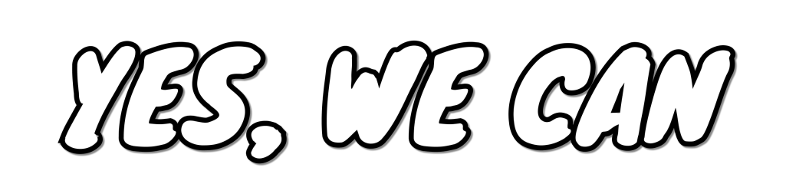
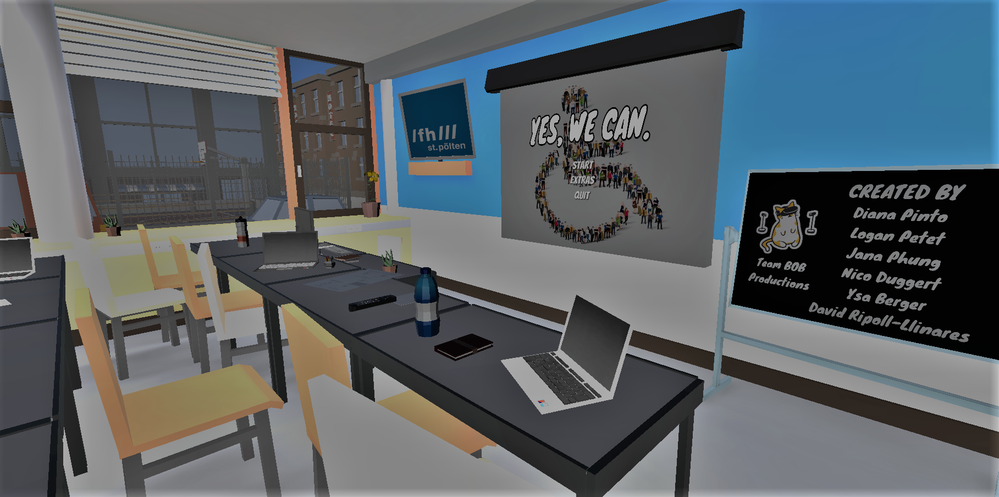
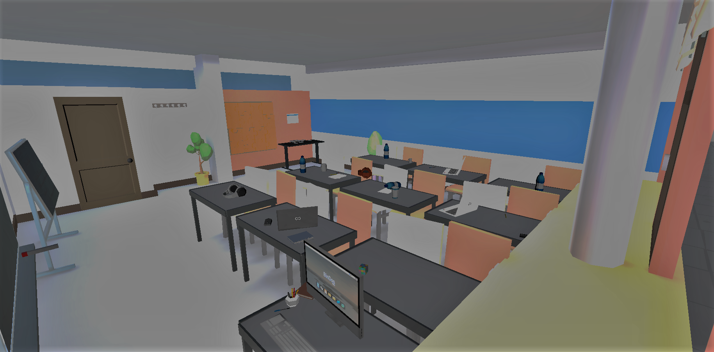
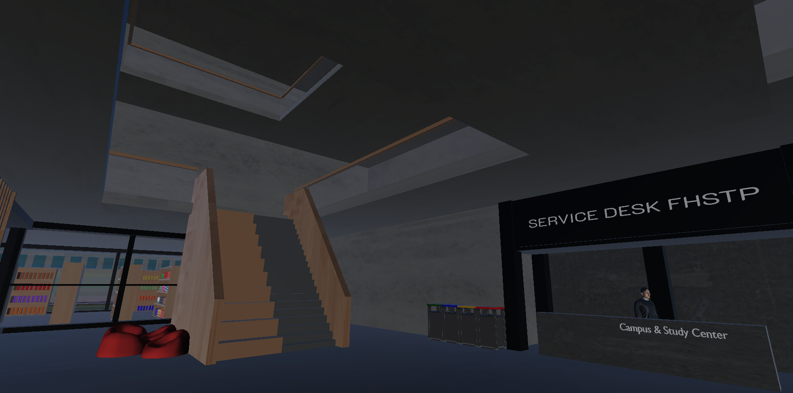
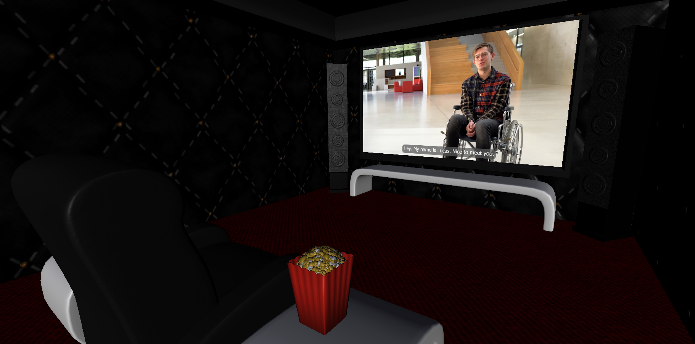
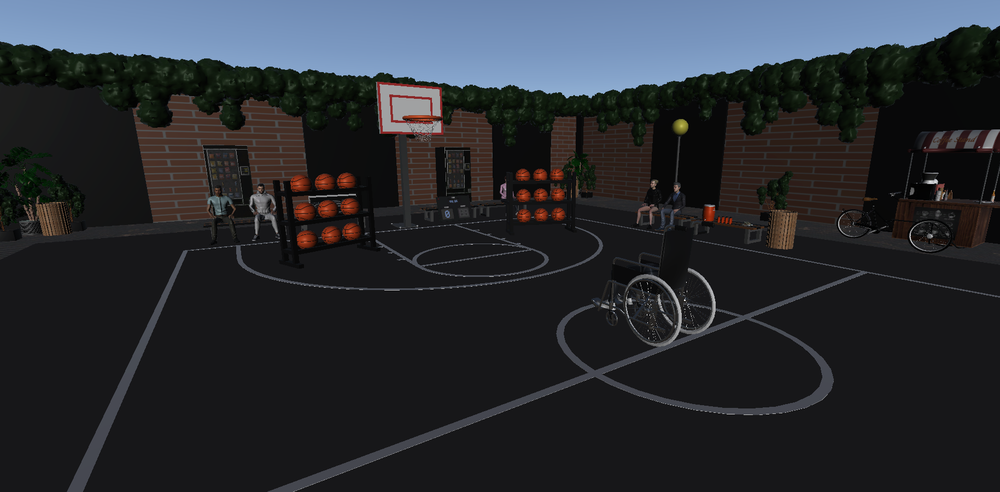

## European Project Semester
## Games & Media

### *A Virtual Reality experience to raise awareness of obstacles and barriers people with disabilities face.*

 

**Screenshots**
|               |             |
| ------------- |:-------------:|
|  |  |
|||
|||

---

**Documentation**

 

* [Project Report](Documentation/Report/EPS%20Project%20Report.pdf)

* [Budget](Documentation/Budget/Grant%20Call%20Application.pdf)

----

**&copy; Team BOB**

